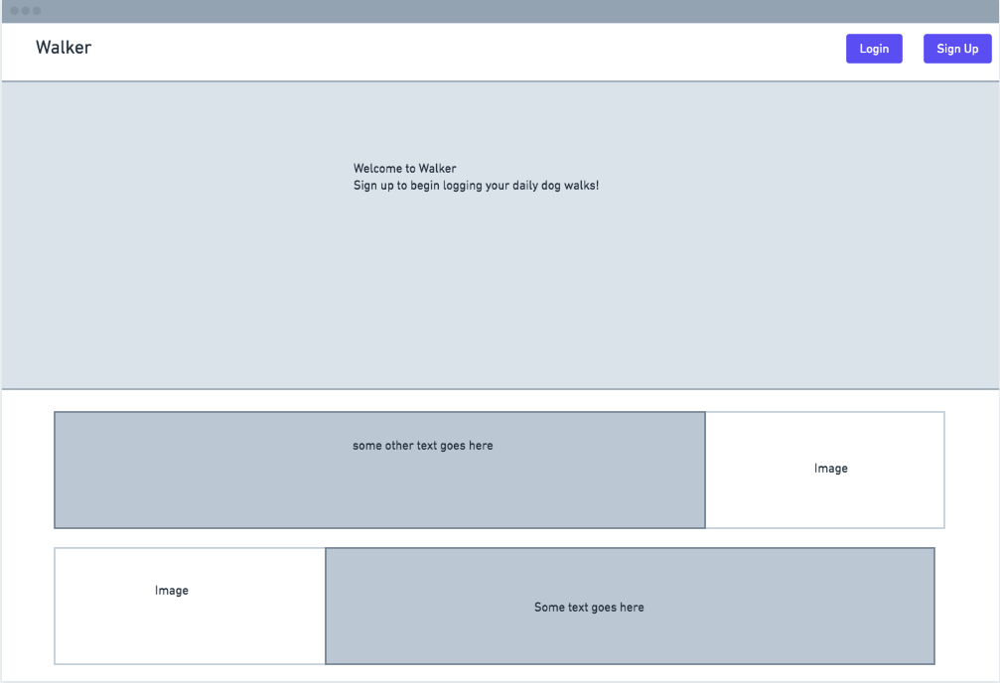
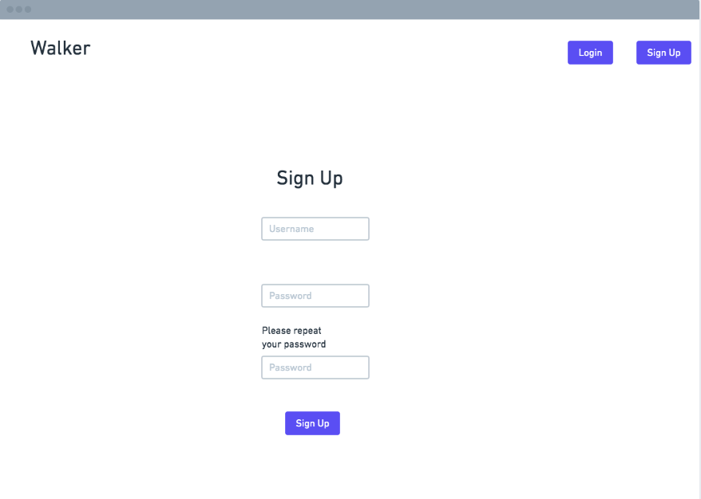
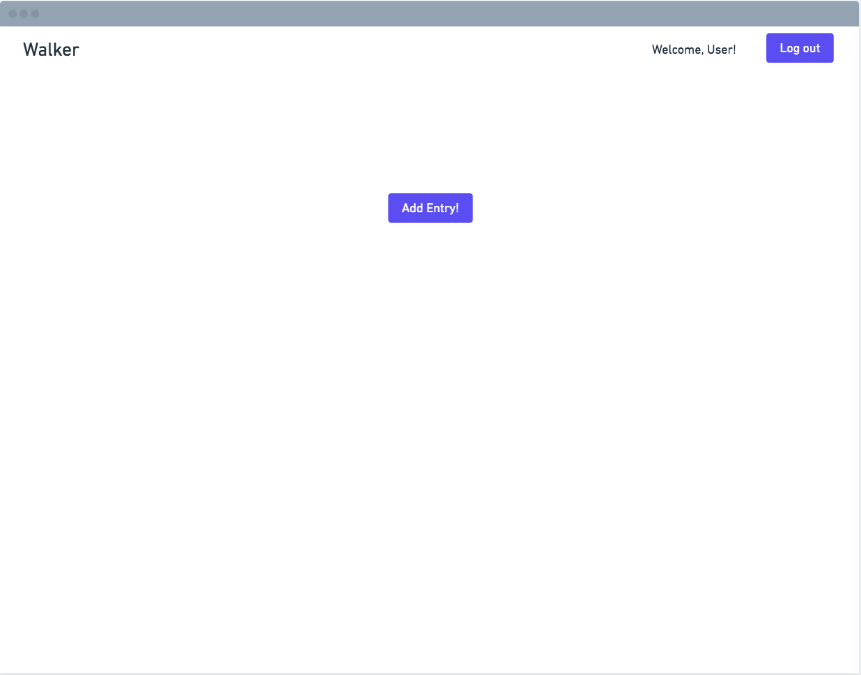
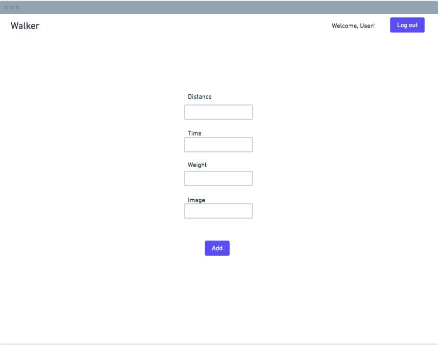

## Project 4 - Walker

### Description
A dog walking app that allows users to be able to log and track statistics of their daily dog walks.

### Wireframes

#### Home



#### Sign Up



#### Login


#### Entries



#### New Entry




### MVP User Stories

- As a user I want to be able to see a home page with  a nav bar that has a login and signup button

- As a user I want to be able to create an account or log in to my existing account

- As a user I want to be able to add a new entry to my daily walks

- As a user I should be able to specify the distance walked, my dogs weight for that day, and how long it took to complete that walk.

- As a user I also want to add images to visually document my pet's progress.


### Response 

```
{
   "distance": "1.75",
   "weight": "35",
   "time": "10",
   "image_url": "my_dog.jpg"
}